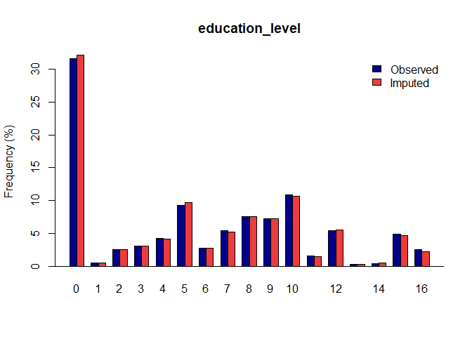
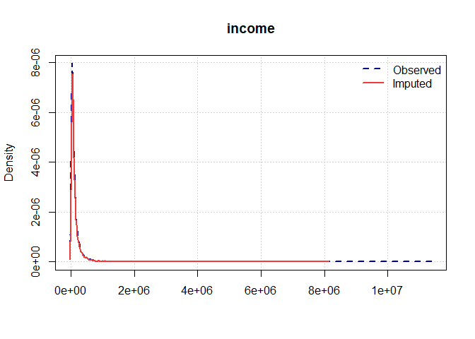

<!-- README.md is generated from README.Rmd. Please edit that file -->

# gerbil - General Efficient Regression-Based Imputation with Latent processes

<!-- badges: start -->

[](https://www.gnu.org/licenses/old-licenses/gpl-2.0.html)
[](https://protect2.fireeye.com/v1/url?k=629f7812-3d0440c6-629f5645-0cc47a335a36-56aa3ca237e81bea&q=1&e=a76afc48-0e78-42f8-8359-5125a03c7e7c&u=https%3A%2F%2Flifecycle.r-lib.org%2Farticles%2Fstages.html)
<!-- badges: end -->

This R package implements coherent multiple imputation of general
multivariate data using the GERBIL algorithm described by Robbins (2020;
arXiv:2008.02243).

## Installation

This package is on CRAN. You are able to install the released version of
gerbil from [CRAN](https://CRAN.R-project.org) with:

``` r
install.packages("gerbil")
```

You can also install directly from this GitHub repository:

``` r
# run if you don't have devtools installed:
install.packages("devtools")
devtools::install_github("michaelwrobbins/gerbil")
```

## Example

Load your dataset and run the `gerbil` function:

``` r
library(gerbil)

# Load the ihd sample data set with MCAR missingness:
data(ihd_mcar)

my_dataset = ihd_mcar

# Run the Imputation Process:
gerbil_object <- gerbil(dat = my_dataset, m = 1, ords = "education_level", semi = "farm_labour_days", bincat = "job_field")
#> Variable Summary:
#>                     Variable.Type Num.Observed Num.Miss Miss.Rate
#> sex                        binary        42125        0     0.00%
#> age              continuous (EMP)        27382    14743    35.00%
#> marital_status             binary        27382    14743    35.00%
#> job_field             categorical        27382    14743    35.00%
#> farm_labour_days         semicont        27382    14743    35.00%
#> own_livestock              binary        27382    14743    35.00%
#> education_level           ordinal        27382    14743    35.00%
#> income           continuous (EMP)        27382    14743    35.00%
#> 
#> Completed transformations, Time = 0.15
#> Imp. 1: gerbil initialized.  Time = 2.06
#> Imp. 1: MCMC iteration 1 completed. Total time = 1.70, I-Step: 1.67, P-Step: 0.03
#> Imp. 1: MCMC iteration 2 completed. Total time = 1.81, I-Step: 1.78, P-Step: 0.03
#> Imp. 1: MCMC iteration 3 completed. Total time = 1.58, I-Step: 1.55, P-Step: 0.03
#> Imp. 1: MCMC iteration 4 completed. Total time = 1.69, I-Step: 1.67, P-Step: 0.02
#> Imp. 1: MCMC iteration 5 completed. Total time = 1.69, I-Step: 1.66, P-Step: 0.03
#> Imp. 1: MCMC iteration 6 completed. Total time = 1.75, I-Step: 1.72, P-Step: 0.03
#> Imp. 1: MCMC iteration 7 completed. Total time = 1.70, I-Step: 1.67, P-Step: 0.03
#> Imp. 1: MCMC iteration 8 completed. Total time = 1.66, I-Step: 1.63, P-Step: 0.03
#> Imp. 1: MCMC iteration 9 completed. Total time = 1.71, I-Step: 1.68, P-Step: 0.03
#> Imp. 1: MCMC iteration 10 completed. Total time = 1.53, I-Step: 1.50, P-Step: 0.03
#> Imp. 1: MCMC iteration 11 completed. Total time = 1.77, I-Step: 1.73, P-Step: 0.04
#> Imp. 1: MCMC iteration 12 completed. Total time = 1.66, I-Step: 1.63, P-Step: 0.03
#> Imp. 1: MCMC iteration 13 completed. Total time = 1.74, I-Step: 1.71, P-Step: 0.03
#> Imp. 1: MCMC iteration 14 completed. Total time = 1.78, I-Step: 1.75, P-Step: 0.03
#> Imp. 1: MCMC iteration 15 completed. Total time = 1.78, I-Step: 1.75, P-Step: 0.03
#> Imp. 1: MCMC iteration 16 completed. Total time = 1.67, I-Step: 1.64, P-Step: 0.03
#> Imp. 1: MCMC iteration 17 completed. Total time = 1.86, I-Step: 1.83, P-Step: 0.03
#> Imp. 1: MCMC iteration 18 completed. Total time = 1.61, I-Step: 1.58, P-Step: 0.03
#> Imp. 1: MCMC iteration 19 completed. Total time = 1.55, I-Step: 1.51, P-Step: 0.04
#> Imp. 1: MCMC iteration 20 completed. Total time = 1.64, I-Step: 1.61, P-Step: 0.03
#> Imp. 1: MCMC iteration 21 completed. Total time = 1.57, I-Step: 1.54, P-Step: 0.03
#> Imp. 1: MCMC iteration 22 completed. Total time = 1.58, I-Step: 1.55, P-Step: 0.03
#> Imp. 1: MCMC iteration 23 completed. Total time = 1.52, I-Step: 1.49, P-Step: 0.03
#> Imp. 1: MCMC iteration 24 completed. Total time = 1.55, I-Step: 1.53, P-Step: 0.02
#> Imp. 1: MCMC iteration 25 completed. Total time = 1.49, I-Step: 1.47, P-Step: 0.02
#> Completed untransformations for imputed dataset 1, Time = 0.04
```

Once you have a gerbil object, you can use the `plot` function to verify
the quality of your
imputations:

``` r
plot(gerbil_object)
```



## Vignettes

We have developed package vignettes that are available within the
./vignettes folder in this repository.

## Tests

This package is tested at every build by the automated tests listed
within the `./tests/testthat` folder.

### Test Coverage

One can verify our test coverage statistics by opening the r package r
project and running:

``` r
# load all functions
devtools::test_coverage()
```
