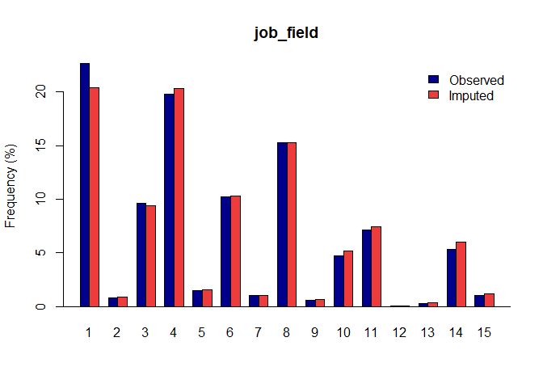
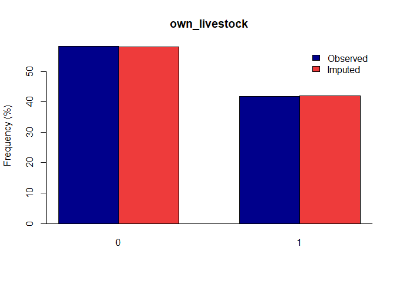

<!-- README.md is generated from README.Rmd. Please edit that file -->

# gerbil - Generalized Efficient Regression-Based multivariate Imputation with Latent processes

<!-- badges: start -->

[](https://www.gnu.org/licenses/old-licenses/gpl-2.0.html)
[](https://protect2.fireeye.com/v1/url?k=629f7812-3d0440c6-629f5645-0cc47a335a36-56aa3ca237e81bea&q=1&e=a76afc48-0e78-42f8-8359-5125a03c7e7c&u=https%3A%2F%2Flifecycle.r-lib.org%2Farticles%2Fstages.html)
<!-- badges: end -->

This R packageimplements a coherent multiple imputation of general
multivariate data as implemented through the GERBIL algorithm described
by Robbins (2020).

## Installation

Once the package is submitted to cran, you will be able to install the
released version of gerbil from [CRAN](https://CRAN.R-project.org) with:

``` r
install.packages("gerbil")
```

For now, you have two options:

1)  E-mail Pedro (<plima@rand.org>) and ask for the development version
    of the gerbil package. Once you get the gerbil package, you can
    install it with:

<!-- end list -->

``` r
# run if you don't have devtools installed:
install.packages("devtools")
devtools::install_local("file_you_get_from_pedro.tar.gz")
```

2)  Download this repository

You can also download this repository, open the gerbil R project and
load all functions without building the package.

``` r
# load all functions
devtools::load_all()
```

## Example

Load your dataset and run the `gerbil` function:

``` r
library(gerbil)

# Load the idh sample data set:
data(ihd)

my_dataset = ihd

# Run the Imputation Process:
gerbil_object <- gerbil(dat = my_dataset, m = 1, ords = "education_level", semi = "farm_labour_days", bincat = "job_field")
#> Variable Summary:
#>                  Variable.Type Num.Observed Num.Miss Miss.Rate
#> sex                     binary        40048     2107     5.00%
#> age                        EMP        42155        0     0.00%
#> marital_status     categorical        42155        0     0.00%
#> job_field          categorical        40048     2107     5.00%
#> farm_labour_days      semicont        40048     2107     5.00%
#> own_livestock           binary        42155        0     0.00%
#> education_level        ordinal        40019     2136     5.07%
#> income                     EMP        40048     2107     5.00%
#> 
#> Completed transformations, Time = 0.33
#> Imp. 1: gerbil initialized.  Time = 3.52
#> Imp. 1: MCMC iteration 1 completed. Total time = 3.56, I-Step: 3.51, P-Step: 0.05
#> Imp. 1: MCMC iteration 2 completed. Total time = 3.44, I-Step: 3.39, P-Step: 0.05
#> Imp. 1: MCMC iteration 3 completed. Total time = 3.46, I-Step: 3.41, P-Step: 0.05
#> Imp. 1: MCMC iteration 4 completed. Total time = 3.45, I-Step: 3.40, P-Step: 0.05
#> Imp. 1: MCMC iteration 5 completed. Total time = 3.45, I-Step: 3.40, P-Step: 0.05
#> Completed untransformations for imputed dataset 1, Time = 0.04
```

Once you have a gerbil object, you can use the `plot` function to verify
the quality of your
imputations:

``` r
plot(gerbil_object)
```



## Vignettes

Max Griswold is developing package vignettes that are available within
the ./vignettes folder in this repository.

## Tests

This package is tested at every build by the automated tests listed
within the `./tests/testthat` folder.

### Test Coverage

One can verify our test coverage statistics by opening the r package r
project and running:

``` r
# load all functions
devtools::test_coverage()
```
